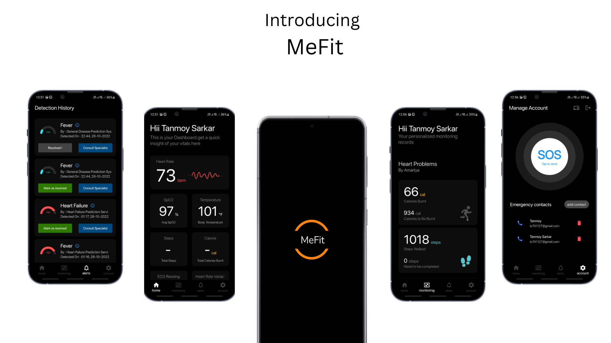
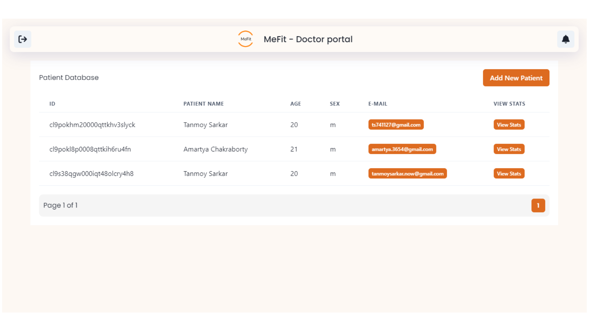
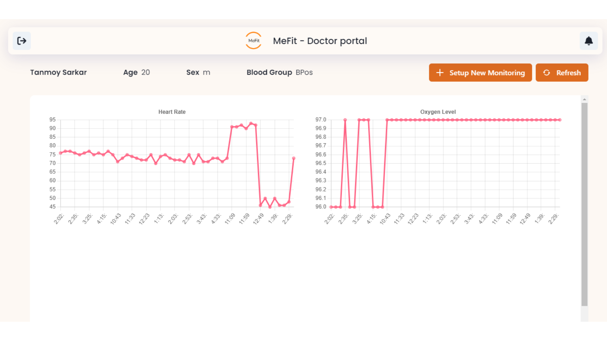
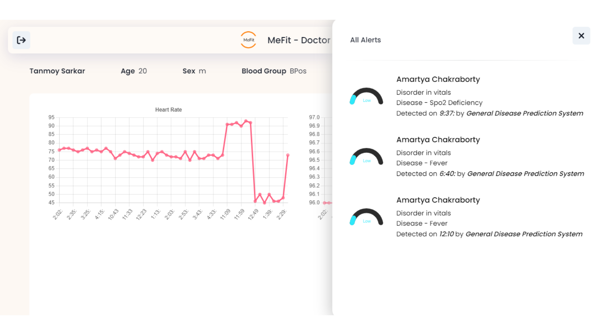
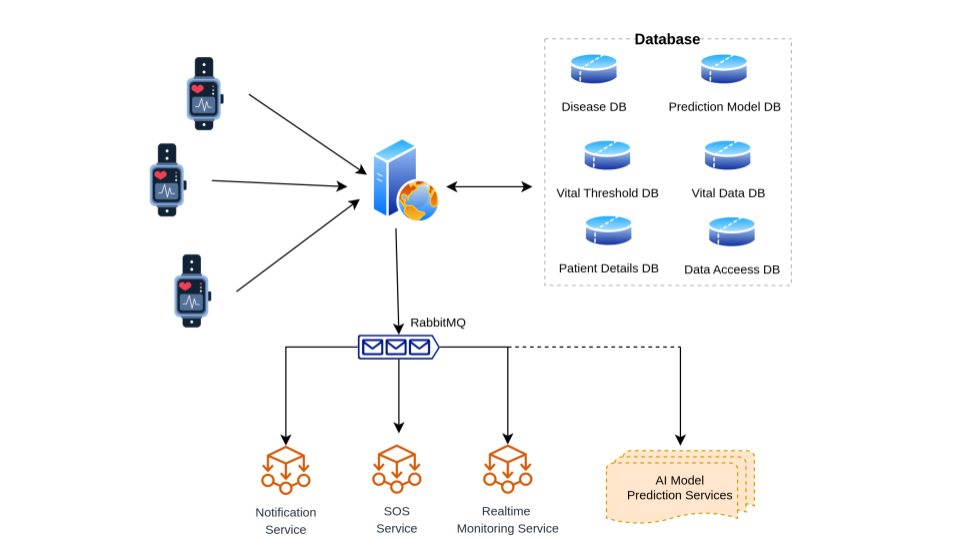
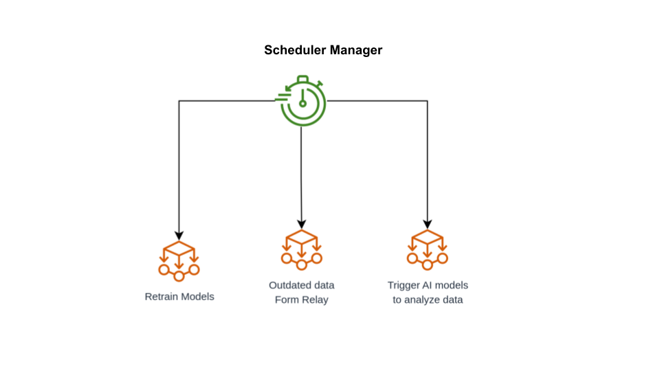

## MeFit - IoT Based Health Monitoring & AI based Disease Detection System

### App Preview

### Doctor Admin Portal Preview

## 🟢 Project has been live

### Steps to access Doctor Admin Portal
- Link :   [https://mefitdoctor.netlify.app/](https://mefitdoctor.netlify.app/)

- Testing Credentials :
    - E-mail : doctor@test.com
    - Password : 888530

### Steps to access MeFit Android App
- [Click here to download android app](./assets/mefit-app.apk)
- Testing Credentials
    - E-mail : patient@test.com
    - Password : 613783

---

## 🟡 Tech Stack

|  Type | Tech Stack  | Link |
|----------|:-------------:|------:|
| Backend | NodeJS | [Click here]("./backend) |
| Message Queue | RabbitMQ | - |
| Android App for User | Flutter | [Click here]("./mefit_android_app")
| Doctor Admin Panel | ReactJS | [Click here]("./doctor_admin_panel")
| ML Models | Python (Sckit-learn) | [Click here]("./ml_models")
| Hardware | C++ | [Click here]("./hardware_codebase")
| Health Simulator | QT C++ | [Click here]("./health_simulator")

---
## 🔵 High Level System Design
#### During design of this project, microservice architecture has been followed to lower the latency and optimize realtime monitoring by converting ai models , notification and SOS service to microservices

---
## Guide to run in local system
### Steps to run backend
- Clone the [backend]("./backend") folder
- Clone .env-example file and rename it to .env
- Fill the values .env with appropiate values
- If you are adding new database, run `npm run dbMigrate` and `npm run dbDeploy`
- Start core backend service by running `npm run start`
- Start consumer process by running `node start_consumer.js`
- Start job scheduler by running `start_jobs.js`

### Steps to run Doctor Admin Panel
- Clone the [doctor_admin_panel]("./doctor_admin_panel") folder
- Update *BASE_URL* with your deployed link of backend in project
- Run `npm start` or build by `npm run build`

### Steps to build Android App
- Clone the [mefit_android_app App]("./mefit_android_app") folder
- Go to `lib/config/config.dart` file and update `baseDomain` with deployed  url of backend
- To build apk file , run `flutter build apk --release`

### Steps to run ML Models as a microservice
- Clone the  [ml_models]("./ml_models") folder 
- For each subfolder there will be an `predict.py` file [*also there can be an `train.py` file*] .
- In main section of each file , update the rabbitmq username, rabbitmq password, rabbitmq url, rabbitmq vhost and backend url
- To start the microservice run `python predict.py` or `python train.py`

### Steps to run Health Simulator
- Clone the [health_simulator]("./health_simulator") folder
- To compiler or run , QT vesion>=6.0.0 need to be installed in local system
- You can open the project with QT editor and run/build directly from IDE

### Steps to install code in Nodemcu [Hardware]
- Clone the [hardware_codebase]("./hardware_codebase") folder
- Open `code.ino` folder in Arduino IDE
- Update `WIFI_SSID` and `WIFI_PASSWORD`
- Update `hardware_id` with random number
- Connect `Nodemcu v1.0` to Arduino IDE
- Clik on `Upload`

---
### For detailed information, watch [this video](https://www.youtube.com/watch?v=W0Sel2hdxIs)
<iframe width="560" height="315" src="https://www.youtube.com/embed/W0Sel2hdxIs" title="YouTube video player" frameborder="0" allow="accelerometer; autoplay; clipboard-write; encrypted-media; gyroscope; picture-in-picture" allowfullscreen></iframe>

[Click here to open video in youtube](https://www.youtube.com/watch?v=W0Sel2hdxIs)

---
## 🟠 Author of this repo
### Presnted by Team ***KrazyDevs*** in ***Optum Stratathon Season 4***
#### Team Members
- [Amartya Chakraborty](https://github.com/cAmartya)
- [Tanmoy Sarkar](https://github.com/Tanmoy741127/)
- [Snehanjan Roy](https://github.com/Snehanjan2001)